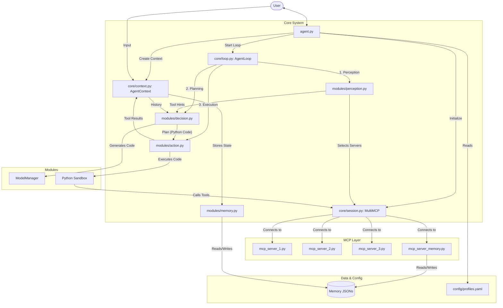

# Cortex-R Agent (EAG v2, Class S9)

A reasoning-driven agent that uses a perception → planning → action loop with MCP servers to search documents, perform web queries, and synthesize answers. It includes FAISS-based retrieval, web extraction, and conservative single-tool execution planning to keep runs deterministic and debuggable.

## Project Overview

- Core loop orchestrates perception, tool selection, planning, sandbox execution, and iterative refinement.
- MCP servers provide tools for document search (FAISS), web search (DuckDuckGo/Google CSE), webpage fetch/markdown conversion, and PDF extraction.
- Prompts guide planning with strict one-tool calls and clear FINAL_ANSWER vs FURTHER_PROCESSING_REQUIRED behavior.
- Memory captures session outputs for traceability.

## Folder Structure

```
S9/
├─ agent.py                      # CLI entrypoint to run the agent
├─ models.py                     # Pydantic models for tool inputs/outputs
├─ pyproject.toml                # Project dependencies and settings
├─ core/                         # Core agent orchestration
│  ├─ context.py                 # AgentContext state (user input, memory, dispatcher)
│  ├─ loop.py                    # Perception → planning → execution loop
│  ├─ session.py                 # MultiMCP wiring and dispatcher
│  ├─ strategy.py                # Decision prompt path selection
├─ modules/                      # Agent modules and tools
│  ├─ action.py                  # Sandbox runner (executes generated solve())
│  ├─ decision.py                # Plan generation via prompts
│  ├─ mcp_server_memory.py       # Memory integration helpers
│  ├─ memory.py                  # Memory utilities
│  ├─ model_manager.py           # Model routing/selection
│  ├─ perception.py              # Perception (intent/entities/tool hints)
│  ├─ tools.py                   # Tool catalog summarizer
├─ prompts/                      # Planning prompt templates
│  ├─ decision_prompt*.txt       # Conservative and exploratory prompt variants
│  ├─ perception_prompt.txt      # Perception LLM prompt
├─ Heuristics/                   # Optional heuristics used by the loop
│  ├─ heuristics.py              # Generic summarization / loop breaking heuristics
├─ documents/                    # Source documents for RAG
│  ├─ *.md, *.txt, images/       # Input documents and images
├─ faiss_index/                  # Vector index and metadata
│  ├─ index.bin                  # FAISS index file
│  ├─ metadata.json              # Document/chunk metadata
│  ├─ doc_index_cache.json       # Per-file hash cache for incremental indexing
├─ memory/                       # Session logs and persisted intermediate results
│  └─ YYYY/MM/DD/session/...     # Dated session trees
├─ mcp_server_1.py               # Demo/math tools
├─ mcp_server_2.py               # RAG tools: search_stored_documents, convert_webpage_url_into_markdown, extract_pdf
├─ mcp_server_3.py               # Web tools: duckduckgo_search_results, download_raw_html_from_url
├─ tests                         # Optional tests (if present)
│  ├─ test_ddg_search.py         # Websearch tool tests
│  ├─ test_heuristics.py         # Heuristics tests
└─ README.md                     # This file
```

## Key Documents

- `architecture.md`, `flowchart.md`: High-level architecture and flow diagrams.
- `HEURISTICS_TEST_GUIDE.md`: Notes on heuristic behavior and testing.
- `error_fix_report.md`: Change log or bug fix notes.

## Setup

1. Install Python 3.10+ and `uv` (recommended fast runner), or use your existing environment.
2. Ensure required environment variables (for websearch) are present:
   - `GOOGLE_API_KEY` and `GOOGLE_CSE_ID` in `.env` for Google CSE-backed search
3. Install dependencies:

```powershell
# From the S9 folder
uv sync
```

## Running

```powershell
# Start the agent (PowerShell)
uv run agent.py
```

The agent will initialize MCP servers and prompt: "What do you want to solve today?".

## Configuration

- `config/models.json`: Model IDs and endpoints (e.g., local embeddings via Ollama).
- `config/profiles.yaml`: Strategy configuration: max steps, lifelines, planning mode.

## Tools

- `search_stored_documents`: FAISS-based RAG search over `documents/`.
- `convert_webpage_url_into_markdown`: Fetches and converts a URL to markdown.
- `extract_pdf`: Extracts clean text from PDF files.
- `duckduckgo_search_results`: Websearch via Google CSE; returns formatted results.
- `download_raw_html_from_url`: Retrieves raw HTML content.

## Development Notes

- Conservative planning prompts enforce exactly one tool call per iteration.
- `FURTHER_PROCESSING_REQUIRED` triggers the loop to forward tool output to the next step for synthesis.
- Perception is skipped on continuation to avoid repeated identical searches (cached servers reused).

## Troubleshooting

- FAISS index stale or corrupted:
  - Delete `faiss_index/index.bin`, `faiss_index/metadata.json`, and `faiss_index/doc_index_cache.json`.
  - Rebuild by running the agent; it will process `documents/` again.
- Websearch returns escaped JSON (e.g., `\u20b9`): The loop formats forwarded results for readability.
- If no tools are selected: Check perception configuration and prompts.

## Contribution & Maintenance

- Keep changes minimal and aligned with current style.
- Update prompt guidance when adding tools or changing behavior.
- Add tests for new tools in `tests/`.

## License

Internal/class project. Do not redistribute without permission.

## Agent Execution Screenshot


*The agent in action: Complete execution flow with detailed logging of all internal steps including perception, memory retrieval, decision-making, and action execution.*

## Documentation

📄 **[Architecture Report (PDF)](Architecture_report.pdf)** - Detailed architecture documentation and design decisions



