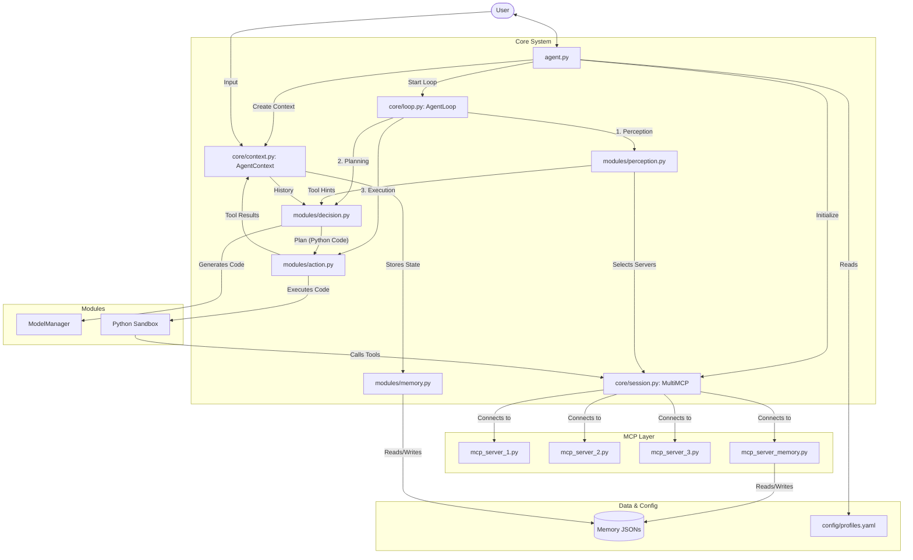

# Agent Architecture

This document describes the high-level architecture of the Cortex-R Agent based on the codebase analysis.

## System Overview

The agent is designed as a modular system with a central loop that orchestrates perception, planning, and execution. It uses the Model Context Protocol (MCP) to interact with external tools and memory.



## ASCII Architecture (Text Version)

```text
+----------------+
|      User      |
+-------+--------+
        | Input/Output
        v
+-------+--------+
|    agent.py    | <--- Reads [config/profiles.yaml]
+-------+--------+
        |
        +---> Initializes [core/session.py: MultiMCP]
        |
        v
+-------+-------------------------+
| core/context.py: AgentContext   | <---> [modules/memory.py] <---> [Memory JSONs]
+-------+-------------------------+
        |
        v
+-------+-------------------------+
| core/loop.py: AgentLoop         |
+-------+-------------------------+
        |
        +---> 1. Perception [modules/perception.py]
        |        (Selects Servers via MultiMCP)
        |
        +---> 2. Planning [modules/decision.py]
        |        (Generates Code via LLM)
        |
        +---> 3. Execution [modules/action.py]
                 |
                 v
        +--------+---------+
        |  Python Sandbox  |
        +--------+---------+
                 | Calls Tools
                 v
        +--------+---------+
        |    MultiMCP      |
        +--------+---------+
                 |
                 +---> [mcp_server_1.py]
                 |
                 +---> [mcp_server_2.py]
                 |
                 +---> [mcp_server_3.py]
                 |
                 +---> [mcp_server_memory.py]
```

## Component Description

1.  **Entry Point (`agent.py`)**:
    *   Loads configuration from `config/profiles.yaml`.
    *   Initializes the `MultiMCP` dispatcher to discover tools from configured servers.
    *   Manages the main user input loop and session creation.
    *   Instantiates `AgentContext` and runs `AgentLoop`.

2.  **Core Loop (`core/loop.py`)**:
    *   Orchestrates the agent's lifecycle (Perception -> Planning -> Execution).
    *   Manages the step counter and lifelines (retries).
    *   Handles `FINAL_ANSWER` and `FURTHER_PROCESSING_REQUIRED` signals.

3.  **Context (`core/context.py`)**:
    *   Maintains the state of the current session.
    *   Holds user input, `AgentProfile`, `MemoryManager`, and task progress.
    *   Acts as the central data store passed between modules.

4.  **Perception (`modules/perception.py`)**:
    *   Analyzes user input to determine intent and entities.
    *   Selects relevant MCP servers/tools to reduce noise for the planner.
    *   Uses `prompts/perception_prompt.txt`.

5.  **Planning (`modules/decision.py`)**:
    *   Generates a Python function `solve()` to address the user's request.
    *   Injects session memory and tool descriptions into the prompt.
    *   Uses `prompts/decision_prompt_conservative.txt`.

6.  **Execution (`modules/action.py`)**:
    *   Executes the generated `solve()` function in a sandboxed environment.
    *   Intercepts tool calls and routes them through `MultiMCP`.
    *   Captures results and errors.

7.  **MCP Layer (`core/session.py`)**:
    *   `MultiMCP` manages connections to multiple MCP servers.
    *   Discovers tools at startup and handles tool execution requests.
    *   Supports stateless tool calls (spins up/down processes as needed).

8.  **Memory (`modules/memory.py` & `modules/mcp_server_memory.py`)**:
    *   `MemoryManager` handles low-level file I/O for session history (JSON).
    *   `mcp_server_memory.py` exposes memory search and retrieval as an MCP tool, allowing the agent to query its own history.
