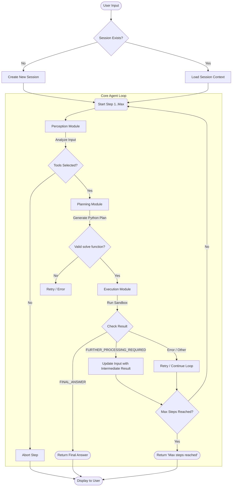

# Agent Execution Flowchart

This flowchart illustrates the step-by-step logic of the Cortex-R Agent, focusing on the decision-making process within the main loop.



## ASCII Flowchart (Text Version)

```text
[User Input]
     |
     v
<Session Exists?> --No--> [Create New Session]
     |                          |
    Yes                         |
     v                          v
[Load Session Context] --> [Start Loop (Step 1..Max)]
                                |
                                v
                        [Perception Module]
                                |
                                v
                        <Tools Selected?> --No--> [Abort Step]
                                |
                               Yes
                                |
                                v
                        [Planning Module]
                                |
                                v
                        <Valid solve() function?> --No--> [Retry/Error]
                                |
                               Yes
                                |
                                v
                        [Execution Module (Sandbox)]
                                |
                                v
                        <Check Result>
                        /       |       \
        "FINAL_ANSWER" /        |        \ "Error/Other"
                      /         | "FURTHER_PROCESSING_REQUIRED"
                     v          v          v
          [Return Final Answer] [Update Input] [Retry/Continue]
                     |          |          |
                     |          v          |
                     |    <Max Steps Reached?>
                     |      /        \
                     |     No        Yes
                     |      |          \
                     |      v           v
                     |  [Start Loop]  [Return 'Max steps reached']
                     |
                     v
             [Display to User]
```

## Process Description

1.  **Initialization**: The agent checks if a session exists. If not, it creates one to store memory and context.
2.  **Perception**: The agent analyzes the user's input to understand intent and selects the relevant tools (e.g., Web Search, Documents, Math).
3.  **Planning**: A Large Language Model (LLM) generates a Python function (`solve()`) to execute the next logical step.
4.  **Execution**: The generated code is executed in a secure sandbox. The code calls the selected tools.
5.  **Result Evaluation**:
    *   **FINAL_ANSWER**: If the tool provides a complete answer, the loop ends, and the result is shown to the user.
    *   **FURTHER_PROCESSING_REQUIRED**: If the tool returns raw data (e.g., a long document), the agent feeds this data back into the loop as "input" for the next step, allowing it to summarize or analyze it.
    *   **Looping**: The agent continues this cycle until it finds an answer or hits the maximum number of steps (configured in `profiles.yaml`).
